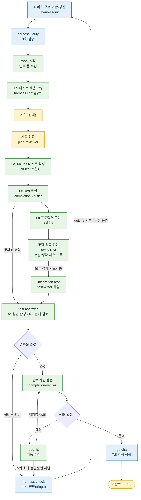

# solution-harness-plugin

앱팀(Android / iOS) 공통 **harness-engineering** 워크플로우 플러그인.
입력 → 테스트 레벨 확정 → (계획 → 계획검수) → unit 테스트 작성 → Red 확인 → 구현 → 통합/E2E → 검증 → bug-fix 로 이어지는 **닫힌 루프**를 구성하고, 하네스 문서로 Claude Code 에 프로젝트 그래프를 제공한다.

## 사전 요구
- **`superpowers` 플러그인 (필수)** — `work` 가 계획 경로에서 `superpowers:brainstorming` 을 호출한다. 미설치 시 `/work` 의 계획 단계가 동작하지 않는다. unit 테스트 작성은 플러그인 안의 `unit-test` 스킬이 담당하므로 외부 의존이 없다.

## 구성

### Skills
| 스킬 | 역할 |
|------|------|
| `harness-init` | 하네스 구축·이관·갱신 단일 진입점 (스크립트 + 인터뷰) |
| `gotcha` | 사람 지식 한 줄을 GOTCHA 또는 모듈 CLAUDE.md 에 기록 |
| `harness-verify` | 하네스 문서 3축 검증 |
| `harness-check` | 산출물↔하네스 불일치 진단 → 로컬 기록 |
| `work` | 닫힌 루프 엔진 (입력→레벨 확정→(계획→검토)→6a~6d→통합/E2E→검증) |
| `unit-test` | 한 모듈 안 단위 테스트 **코드 작성** (test-first). work 6b 가 호출 — 실행은 안 함 |
| `integration-test` | 모듈 경계 통합 테스트 **코드 작성** (test-after). work 6.5 가 경계 감지 시 호출 — 실행은 안 함 |
| `e2e-test` | 사용자 플로우 E2E 테스트 **코드 작성** (test-after). work 6.5 가 플로우 완성 시 호출 — 자동 실행 안 함(사람 게이트) |
| `test-level` | `harness.config.yml` 테스트 범위 확인·변경 (다중 선택, 없으면 생성) |
| `pin` | 진행 중 work 의 현재 상태를 활성 run 파일에 즉시 스냅샷 (갱신만) |

### Sub-agents
| Agent | 역할 |
|------|------|
| `harness-scout` | 인터뷰 질문 생성 / 구문서 지식 추출 — 문서를 쓰지 않음 (sonnet) |
| `harness-doc-verifier` | 문서 3축 검증 (opus) |
| `plan-reviewer` | 계획 7축 검토 (opus) |
| `completion-verifier` | 6c Red 확인·완료기준 명령 격리 실행·결과 보고 (opus) |
| `test-writer` | 3열 명세를 받아 테스트 코드 작성 — 스킬만 호출 (opus) |
| `test-reviewer` | 작성된 테스트의 단언 품질 4축 진단 — 수정 안 함 (opus) |

### Hooks
| Hook | 역할 |
|------|------|
| `block-dangerous-command.sh` | 위험 명령 차단 (PreToolUse/Bash) |
| `harness-decay-notify.sh` | 문서 decay 알림 (PostToolUse/Bash) |

### Script
| Script | 역할 |
|--------|------|
| `shared/scripts/lib/modules.mjs` | 모듈 발견 + 의존성 파싱 — 모듈을 아는 유일한 코드 |
| `shared/scripts/deps.mjs` | 의존성 그래프 즉석 출력 (파일로 저장하지 않음) |
| `shared/scripts/index-modules.mjs` | `docs/MODULE_MAP.md` 생성 + `CLAUDE.md` 트리거 블록 출력 |
| `shared/scripts/signals.mjs` | 이상 신호 7종 수집 → 인터뷰 질문의 앵커 |
| `shared/scripts/verify-docs.mjs` | 앵커 생존 · 줄 수 2축 검증 |

### 내부 참조 문서 (스킬 아님 — `/` 노출 안 됨)
| 문서 | 역할 |
|------|------|
| `shared/bug-fix-loop.md` | 검증 실패 자동 수정 루프 (최대 5회). work 7단계가 Read 해 실행 — 외부 직접 호출 불가 |
| `shared/interview.md` | 인터뷰 절차 — 신호 8종·라운드 8문항·등급·중단 규칙. `harness-init` 이 Read 해 실행 — 외부 직접 호출 불가 |
| `shared/test-levels.md` | 테스트 레벨 정의 + `harness.config.yml` 형식·판정 규칙. `work` 1.5·`/test-level`·테스트 스킬들의 단일 출처 |

## 프로젝트 설정 — `harness.config.yml`

대상 프로젝트 루트의 이 파일이 **어느 레벨의 테스트를 쓸지**를 선언한다. 손으로 만들 필요는 없다 — `/work` 가 파일이 없으면 만들지 묻고, `/test-level` 로 언제든 바꾼다.

생성 내용의 단일 출처는 `shared/test-levels.md` §2 생성 템플릿이다. 여기 사본을 두지 않는다.

| 값 | 대상 | 담당 스킬 |
|---|---|---|
| `unit` | 한 모듈 안 — ViewModel / UseCase / Mapper / 순수 함수 | `unit-test` |
| `integration` | 모듈 경계를 넘는 데이터·계약 | `integration-test` |
| `ui` | Composable 렌더링 · 화면 조작 · 기기 플로우 (**Robolectric 포함**) | `e2e-test` |
| `none` | 테스트를 작성하지 않는다 | — |

- **파일이 없거나 `test.levels` 가 비어 있으면 기본값 `unit, integration`.** UI 테스트는 기본으로 꺼져 있다.
- **"설정 안 함"과 "테스트 안 씀"은 다르다.** 후자는 `test.levels: none` 을 명시해야 한다.
- 형식 위반(`test.levels:unit` — 콜론 뒤 공백 누락)이나 `none` 혼용(`none, unit`)은 자동 해석하지 않고 **사람에게 되묻는다.**
- 정의·판정 규칙의 단일 출처는 `shared/test-levels.md`.
- 변경은 **`/test-level`** 로 한다. 생성 창구는 `work` 1.5 와 `/test-level` 둘뿐이다.

## 생성 파일

### `harness-init`
| 파일 | 설명 |
|------|------|
| `CLAUDE.md` | 자동 로드 주체 — `@docs/GOTCHA.md` 1줄 + CRITICAL + 조건부 로딩 (≤40줄) |
| `docs/GOTCHA.md` | 자동 적재 — 사람만 아는 지식 4섹션 (≤60줄) |
| `docs/MODULE_MAP.md` | 조건부 — 모듈 경로 인덱스 (스크립트 생성) |
| `docs/rules/TESTING.md` | 조건부 — 검증 명령·네이밍·라이브러리·통합/E2E 규칙 (≤80줄) |
| `{module}/CLAUDE.md` | 조건부 — 모듈 gotcha. **`gotcha` 가 기록할 때 생긴다. 미리 만들지 않는다** (≤50줄) |

### 상태·런타임
| 파일 | 설명 |
|------|------|
| `.harness/runs/run-{id}.md` | 진행 상태(계획/단계/완료기준/bug-fix 횟수/결정 로그). work 생성, bug-fix 갱신. **`.harness/` 최초 생성 시 대상 프로젝트 `.gitignore` 에 `.harness/` 자동 등록** |
| `.harness/logs/{명령slug}.log` | 완료기준 명령 실행 로그 — bug-fix 가 받는 핸드오프 입력 |

## 사용 Flow

> 닫힌 루프를 실행하게 하여 사용자(사람)의 개입을 최소화 하는 방향으로 사용

🟩 자동 구간 · 🟨 사람 게이트 · 🟦 하네스(규칙)

